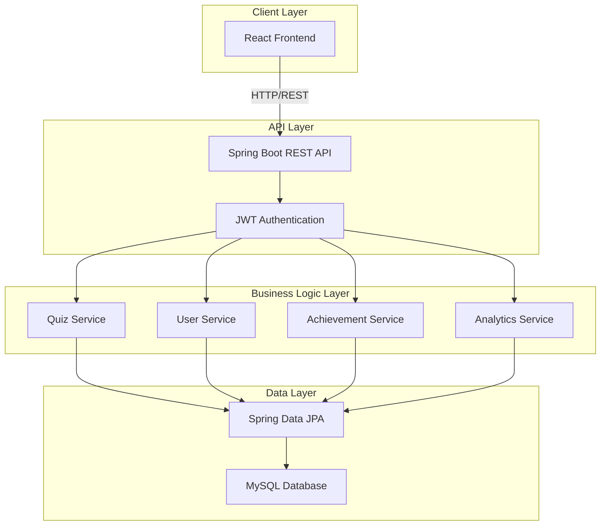

# Ghana Military Quiz Application - Architecture Plan

## Project Overview
A full-featured quiz application focused on Ghana Military knowledge, built with Java Spring Boot backend and React frontend.

## Technology Stack

### Backend
- **Framework**: Spring Boot 3.x
- **Language**: Java 17+
- **Database**: MySQL 8.x
- **ORM**: Spring Data JPA / Hibernate
- **Security**: Spring Security with JWT
- **Build Tool**: Maven
- **API Documentation**: Swagger/OpenAPI

### Frontend
- **Framework**: React 18+
- **Build Tool**: Vite
- **Routing**: React Router v6
- **State Management**: React Context API + Redux Toolkit
- **HTTP Client**: Axios
- **UI Framework**: Material-UI or Tailwind CSS
- **Form Handling**: React Hook Form
- **Charts**: Recharts or Chart.js

### Development Tools
- **Version Control**: Git
- **API Testing**: Postman
- **Code Editor**: VS Code

## System Architecture



## Database Schema

### Core Tables

#### users
- id (PK, BIGINT, AUTO_INCREMENT)
- username (VARCHAR, UNIQUE, NOT NULL)
- email (VARCHAR, UNIQUE, NOT NULL)
- password_hash (VARCHAR, NOT NULL)
- full_name (VARCHAR)
- role (ENUM: USER, ADMIN)
- created_at (TIMESTAMP)
- updated_at (TIMESTAMP)
- last_login (TIMESTAMP)
- is_active (BOOLEAN)

#### categories
- id (PK, BIGINT, AUTO_INCREMENT)
- name (VARCHAR, NOT NULL)
- description (TEXT)
- icon (VARCHAR)
- created_at (TIMESTAMP)

#### questions
- id (PK, BIGINT, AUTO_INCREMENT)
- category_id (FK, BIGINT)
- question_text (TEXT, NOT NULL)
- option_a (VARCHAR, NOT NULL)
- option_b (VARCHAR, NOT NULL)
- option_c (VARCHAR, NOT NULL)
- option_d (VARCHAR, NOT NULL)
- correct_answer (ENUM: A, B, C, D)
- explanation (TEXT)
- difficulty_level (ENUM: EASY, MEDIUM, HARD)
- points (INT)
- created_at (TIMESTAMP)
- updated_at (TIMESTAMP)

#### quiz_attempts
- id (PK, BIGINT, AUTO_INCREMENT)
- user_id (FK, BIGINT)
- category_id (FK, BIGINT)
- score (INT)
- total_questions (INT)
- correct_answers (INT)
- time_taken (INT, seconds)
- started_at (TIMESTAMP)
- completed_at (TIMESTAMP)

#### quiz_answers
- id (PK, BIGINT, AUTO_INCREMENT)
- quiz_attempt_id (FK, BIGINT)
- question_id (FK, BIGINT)
- user_answer (ENUM: A, B, C, D)
- is_correct (BOOLEAN)
- time_spent (INT, seconds)

#### achievements
- id (PK, BIGINT, AUTO_INCREMENT)
- name (VARCHAR, NOT NULL)
- description (TEXT)
- icon (VARCHAR)
- criteria_type (VARCHAR)
- criteria_value (INT)
- points (INT)

#### user_achievements
- id (PK, BIGINT, AUTO_INCREMENT)
- user_id (FK, BIGINT)
- achievement_id (FK, BIGINT)
- earned_at (TIMESTAMP)

#### user_progress
- id (PK, BIGINT, AUTO_INCREMENT)
- user_id (FK, BIGINT)
- category_id (FK, BIGINT)
- total_attempts (INT)
- best_score (INT)
- average_score (DECIMAL)
- total_time_spent (INT, seconds)
- last_attempt_at (TIMESTAMP)

## Backend API Endpoints

### Authentication
- `POST /api/auth/register` - Register new user
- `POST /api/auth/login` - Login user
- `POST /api/auth/refresh` - Refresh JWT token
- `POST /api/auth/logout` - Logout user
- `GET /api/auth/me` - Get current user info

### Users
- `GET /api/users/profile` - Get user profile
- `PUT /api/users/profile` - Update user profile
- `GET /api/users/{id}/stats` - Get user statistics
- `GET /api/users/{id}/achievements` - Get user achievements
- `GET /api/users/{id}/progress` - Get user progress by category

### Categories
- `GET /api/categories` - Get all categories
- `GET /api/categories/{id}` - Get category by ID
- `POST /api/categories` - Create category (Admin)
- `PUT /api/categories/{id}` - Update category (Admin)
- `DELETE /api/categories/{id}` - Delete category (Admin)

### Questions
- `GET /api/questions` - Get all questions (Admin)
- `GET /api/questions/{id}` - Get question by ID (Admin)
- `GET /api/questions/category/{categoryId}` - Get questions by category
- `POST /api/questions` - Create question (Admin)
- `PUT /api/questions/{id}` - Update question (Admin)
- `DELETE /api/questions/{id}` - Delete question (Admin)
- `POST /api/questions/bulk` - Bulk import questions (Admin)

### Quiz
- `POST /api/quiz/start` - Start new quiz session
- `GET /api/quiz/{attemptId}` - Get quiz questions
- `POST /api/quiz/{attemptId}/submit` - Submit quiz answers
- `GET /api/quiz/{attemptId}/results` - Get quiz results
- `GET /api/quiz/history` - Get user quiz history

### Leaderboard
- `GET /api/leaderboard/global` - Get global leaderboard
- `GET /api/leaderboard/category/{categoryId}` - Get category leaderboard
- `GET /api/leaderboard/weekly` - Get weekly leaderboard
- `GET /api/leaderboard/monthly` - Get monthly leaderboard

### Achievements
- `GET /api/achievements` - Get all achievements
- `GET /api/achievements/{id}` - Get achievement by ID
- `POST /api/achievements` - Create achievement (Admin)
- `PUT /api/achievements/{id}` - Update achievement (Admin)

### Analytics
- `GET /api/analytics/dashboard` - Get admin dashboard stats
- `GET /api/analytics/questions/{id}/stats` - Get question statistics
- `GET /api/analytics/categories/performance` - Get category performance

## Frontend Structure

```
frontend/
├── public/
│   ├── index.html
│   └── assets/
├── src/
│   ├── components/
│   │   ├── common/
│   │   │   ├── Header.jsx
│   │   │   ├── Footer.jsx
│   │   │   ├── Loader.jsx
│   │   │   └── ErrorBoundary.jsx
│   │   ├── auth/
│   │   │   ├── LoginForm.jsx
│   │   │   ├── RegisterForm.jsx
│   │   │   └── ProtectedRoute.jsx
│   │   ├── quiz/
│   │   │   ├── QuizCard.jsx
│   │   │   ├── QuestionCard.jsx
│   │   │   ├── Timer.jsx
│   │   │   └── ProgressBar.jsx
│   │   ├── profile/
│   │   │   ├── UserStats.jsx
│   │   │   ├── ProgressChart.jsx
│   │   │   └── AchievementBadge.jsx
│   │   ├── leaderboard/
│   │   │   └── LeaderboardTable.jsx
│   │   └── admin/
│   │       ├── QuestionForm.jsx
│   │       ├── QuestionList.jsx
│   │       └── Dashboard.jsx
│   ├── pages/
│   │   ├── Home.jsx
│   │   ├── Login.jsx
│   │   ├── Register.jsx
│   │   ├── Dashboard.jsx
│   │   ├── Categories.jsx
│   │   ├── Quiz.jsx
│   │   ├── Results.jsx
│   │   ├── Profile.jsx
│   │   ├── Leaderboard.jsx
│   │   └── Admin.jsx
│   ├── context/
│   │   ├── AuthContext.jsx
│   │   └── QuizContext.jsx
│   ├── services/
│   │   ├── api.js
│   │   ├── authService.js
│   │   ├── quizService.js
│   │   └── userService.js
│   ├── hooks/
│   │   ├── useAuth.js
│   │   ├── useQuiz.js
│   │   └── useTimer.js
│   ├── utils/
│   │   ├── constants.js
│   │   ├── helpers.js
│   │   └── validators.js
│   ├── styles/
│   │   └── global.css
│   ├── App.jsx
│   └── main.jsx
├── package.json
└── vite.config.js
```

## Backend Structure

```
backend/
├── src/
│   └── main/
│       ├── java/
│       │   └── com/
│       │       └── ghanamilitaryquiz/
│       │           ├── GhanaMilitaryQuizApplication.java
│       │           ├── config/
│       │           │   ├── SecurityConfig.java
│       │           │   ├── JwtConfig.java
│       │           │   └── SwaggerConfig.java
│       │           ├── controller/
│       │           │   ├── AuthController.java
│       │           │   ├── UserController.java
│       │           │   ├── CategoryController.java
│       │           │   ├── QuestionController.java
│       │           │   ├── QuizController.java
│       │           │   ├── LeaderboardController.java
│       │           │   ├── AchievementController.java
│       │           │   └── AnalyticsController.java
│       │           ├── model/
│       │           │   ├── User.java
│       │           │   ├── Category.java
│       │           │   ├── Question.java
│       │           │   ├── QuizAttempt.java
│       │           │   ├── QuizAnswer.java
│       │           │   ├── Achievement.java
│       │           │   ├── UserAchievement.java
│       │           │   └── UserProgress.java
│       │           ├── dto/
│       │           │   ├── request/
│       │           │   │   ├── LoginRequest.java
│       │           │   │   ├── RegisterRequest.java
│       │           │   │   ├── QuizSubmissionRequest.java
│       │           │   │   └── QuestionRequest.java
│       │           │   └── response/
│       │           │       ├── AuthResponse.java
│       │           │       ├── QuizResultResponse.java
│       │           │       ├── LeaderboardResponse.java
│       │           │       └── UserStatsResponse.java
│       │           ├── repository/
│       │           │   ├── UserRepository.java
│       │           │   ├── CategoryRepository.java
│       │           │   ├── QuestionRepository.java
│       │           │   ├── QuizAttemptRepository.java
│       │           │   ├── QuizAnswerRepository.java
│       │           │   ├── AchievementRepository.java
│       │           │   ├── UserAchievementRepository.java
│       │           │   └── UserProgressRepository.java
│       │           ├── service/
│       │           │   ├── AuthService.java
│       │           │   ├── UserService.java
│       │           │   ├── CategoryService.java
│       │           │   ├── QuestionService.java
│       │           │   ├── QuizService.java
│       │           │   ├── LeaderboardService.java
│       │           │   ├── AchievementService.java
│       │           │   └── AnalyticsService.java
│       │           ├── security/
│       │           │   ├── JwtTokenProvider.java
│       │           │   ├── JwtAuthenticationFilter.java
│       │           │   └── UserDetailsServiceImpl.java
│       │           ├── exception/
│       │           │   ├── GlobalExceptionHandler.java
│       │           │   ├── ResourceNotFoundException.java
│       │           │   └── UnauthorizedException.java
│       │           └── util/
│       │               ├── Constants.java
│       │               └── ValidationUtil.java
│       └── resources/
│           ├── application.properties
│           ├── application-dev.properties
│           └── application-prod.properties
├── pom.xml
└── README.md
```

## Key Features Implementation

### 1. User Authentication & Authorization
- JWT-based authentication
- Role-based access control (USER, ADMIN)
- Secure password hashing with BCrypt
- Token refresh mechanism

### 2. Quiz System
- Random question selection from category
- Configurable quiz length and difficulty
- Timer functionality
- Real-time score calculation
- Answer explanations after submission

### 3. Progress Tracking
- Track attempts per category
- Store best scores and averages
- Time spent analytics
- Performance trends over time

### 4. Achievement System
- Predefined achievements:
  - First Quiz Completed
  - Perfect Score
  - Speed Demon (complete in under X seconds)
  - Category Master (complete all questions in category)
  - Streak achievements
  - Total points milestones
- Automatic achievement unlocking
- Achievement notifications

### 5. Leaderboard
- Global rankings
- Category-specific rankings
- Time-based rankings (weekly, monthly)
- Points-based scoring system

### 6. Admin Panel
- Question CRUD operations
- Category management
- User management
- Analytics dashboard
- Bulk question import (CSV/JSON)

### 7. Analytics
- User engagement metrics
- Question difficulty analysis
- Category popularity
- Success rates per question
- Time-based trends

## Security Considerations

1. **Authentication**
   - JWT tokens with expiration
   - Refresh token rotation
   - Secure password requirements

2. **Authorization**
   - Role-based access control
   - Protected admin endpoints
   - User-specific data access

3. **Data Protection**
   - Input validation
   - SQL injection prevention (JPA)
   - XSS protection
   - CORS configuration

4. **API Security**
   - Rate limiting
   - Request validation
   - Error handling without exposing internals

## Quiz Categories (Ghana Military)

1. **Military History**
   - Independence and military formation
   - Major operations and peacekeeping missions
   - Historical battles and conflicts

2. **Ranks and Structure**
   - Officer ranks
   - Enlisted ranks
   - Command structure
   - Insignia and decorations

3. **Military Equipment**
   - Weapons systems
   - Vehicles and aircraft
   - Naval vessels
   - Communication equipment

4. **Training and Doctrine**
   - Training programs
   - Military academies
   - Operational procedures
   - Military law

5. **Notable Figures**
   - Military leaders
   - War heroes
   - Chiefs of Defence Staff

6. **International Relations**
   - UN peacekeeping missions
   - Regional cooperation (ECOWAS)
   - Military alliances
   - Joint exercises

## Development Workflow

### Phase 1: Setup and Foundation
1. Initialize backend Spring Boot project
2. Set up MySQL database
3. Configure Spring Security and JWT
4. Create entity models and repositories
5. Initialize React frontend project

### Phase 2: Core Backend Development
1. Implement authentication endpoints
2. Implement user management
3. Implement question and category management
4. Implement quiz logic

### Phase 3: Advanced Backend Features
1. Implement leaderboard system
2. Implement achievement system
3. Implement analytics
4. Add admin functionality

### Phase 4: Frontend Development
1. Set up routing and authentication
2. Build authentication pages
3. Build quiz interface
4. Build results and feedback pages

### Phase 5: Advanced Frontend Features
1. Build profile and progress pages
2. Build leaderboard page
3. Build admin panel
4. Implement state management

### Phase 6: Integration and Testing
1. Connect frontend to backend
2. End-to-end testing
3. Bug fixes and optimization

### Phase 7: Polish and Deployment
1. UI/UX improvements
2. Performance optimization
3. Documentation
4. Deployment preparation

## Testing Strategy

### Backend Testing
- Unit tests for services
- Integration tests for repositories
- API endpoint tests
- Security tests

### Frontend Testing
- Component unit tests
- Integration tests
- E2E tests with Cypress or Playwright

## Deployment Options

### Backend
- JAR deployment on VPS
- Docker container
- Cloud platforms (AWS, Azure, Heroku)

### Frontend
- Static hosting (Netlify, Vercel)
- Nginx server
- Cloud platforms

### Database
- Managed MySQL (AWS RDS, Azure Database)
- Self-hosted MySQL server

## Performance Optimization

1. **Backend**
   - Database indexing
   - Query optimization
   - Caching (Redis)
   - Connection pooling

2. **Frontend**
   - Code splitting
   - Lazy loading
   - Image optimization
   - Bundle size optimization

## Future Enhancements

1. Mobile application (React Native)
2. Real-time multiplayer quiz
3. Social features (friends, challenges)
4. Question suggestions from users
5. Video/image-based questions
6. Offline mode
7. Push notifications
8. Gamification elements
9. Certificate generation
10. Export progress reports

## Project Timeline Considerations

The project is structured in phases that can be completed incrementally. Focus on building a working MVP first (authentication, basic quiz, results) before adding advanced features like achievements and analytics.

## Resources Needed

1. **Development Environment**
   - Java JDK 17+
   - Node.js 18+
   - MySQL 8+
   - IDE (IntelliJ IDEA, VS Code)

2. **Content**
   - Ghana Military quiz questions database
   - Images for categories and achievements
   - Reference materials for question creation

3. **Design Assets**
   - Logo and branding
   - UI mockups
   - Icons and illustrations

## Success Metrics

1. Functional authentication system
2. Working quiz flow (start, take, submit, results)
3. Admin panel for question management
4. Responsive design
5. Proper error handling
6. Clean, documented code
7. Successful deployment

This architecture provides a solid foundation for building a professional, full-featured quiz application suitable for an end-of-semester project.
