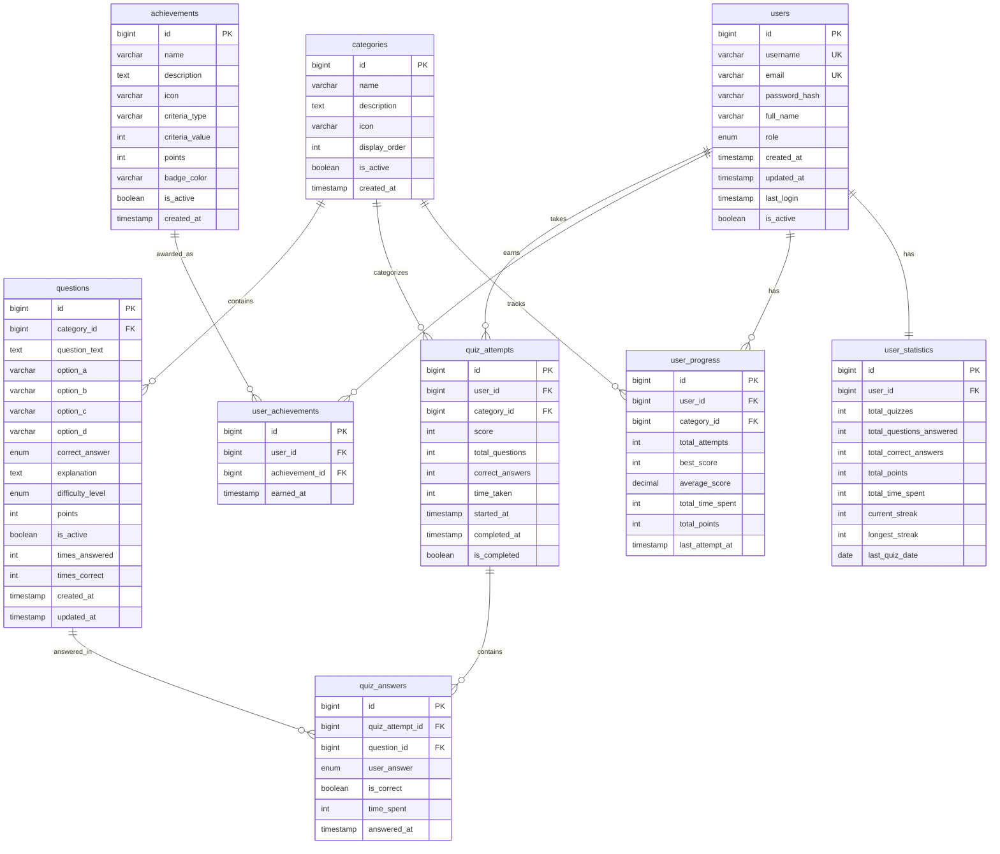

# Database Schema - Ghana Military Quiz Application

## Overview
This document describes the complete database schema for the Ghana Military Quiz application using MySQL 8.x.

## Database Creation

```sql
CREATE DATABASE IF NOT EXISTS ghana_military_quiz;
USE ghana_military_quiz;
```

## Tables

### 1. users
Stores user account information and authentication details.

```sql
CREATE TABLE users (
    id BIGINT AUTO_INCREMENT PRIMARY KEY,
    username VARCHAR(50) UNIQUE NOT NULL,
    email VARCHAR(100) UNIQUE NOT NULL,
    password_hash VARCHAR(255) NOT NULL,
    full_name VARCHAR(100),
    role ENUM('USER', 'ADMIN') DEFAULT 'USER',
    created_at TIMESTAMP DEFAULT CURRENT_TIMESTAMP,
    updated_at TIMESTAMP DEFAULT CURRENT_TIMESTAMP ON UPDATE CURRENT_TIMESTAMP,
    last_login TIMESTAMP NULL,
    is_active BOOLEAN DEFAULT TRUE,
    INDEX idx_username (username),
    INDEX idx_email (email),
    INDEX idx_role (role)
) ENGINE=InnoDB DEFAULT CHARSET=utf8mb4 COLLATE=utf8mb4_unicode_ci;
```

**Fields:**
- `id`: Primary key
- `username`: Unique username for login
- `email`: User's email address
- `password_hash`: BCrypt hashed password
- `full_name`: User's full name
- `role`: USER or ADMIN
- `created_at`: Account creation timestamp
- `updated_at`: Last update timestamp
- `last_login`: Last login timestamp
- `is_active`: Account status

### 2. categories
Stores quiz categories (e.g., Military History, Ranks, Equipment).

```sql
CREATE TABLE categories (
    id BIGINT AUTO_INCREMENT PRIMARY KEY,
    name VARCHAR(100) NOT NULL,
    description TEXT,
    icon VARCHAR(255),
    display_order INT DEFAULT 0,
    is_active BOOLEAN DEFAULT TRUE,
    created_at TIMESTAMP DEFAULT CURRENT_TIMESTAMP,
    INDEX idx_name (name),
    INDEX idx_display_order (display_order)
) ENGINE=InnoDB DEFAULT CHARSET=utf8mb4 COLLATE=utf8mb4_unicode_ci;
```

**Fields:**
- `id`: Primary key
- `name`: Category name
- `description`: Category description
- `icon`: Icon identifier or path
- `display_order`: Order for display
- `is_active`: Whether category is active
- `created_at`: Creation timestamp

### 3. questions
Stores all quiz questions with multiple choice options.

```sql
CREATE TABLE questions (
    id BIGINT AUTO_INCREMENT PRIMARY KEY,
    category_id BIGINT NOT NULL,
    question_text TEXT NOT NULL,
    option_a VARCHAR(500) NOT NULL,
    option_b VARCHAR(500) NOT NULL,
    option_c VARCHAR(500) NOT NULL,
    option_d VARCHAR(500) NOT NULL,
    correct_answer ENUM('A', 'B', 'C', 'D') NOT NULL,
    explanation TEXT,
    difficulty_level ENUM('EASY', 'MEDIUM', 'HARD') DEFAULT 'MEDIUM',
    points INT DEFAULT 10,
    is_active BOOLEAN DEFAULT TRUE,
    times_answered INT DEFAULT 0,
    times_correct INT DEFAULT 0,
    created_at TIMESTAMP DEFAULT CURRENT_TIMESTAMP,
    updated_at TIMESTAMP DEFAULT CURRENT_TIMESTAMP ON UPDATE CURRENT_TIMESTAMP,
    FOREIGN KEY (category_id) REFERENCES categories(id) ON DELETE CASCADE,
    INDEX idx_category (category_id),
    INDEX idx_difficulty (difficulty_level),
    INDEX idx_active (is_active)
) ENGINE=InnoDB DEFAULT CHARSET=utf8mb4 COLLATE=utf8mb4_unicode_ci;
```

**Fields:**
- `id`: Primary key
- `category_id`: Foreign key to categories
- `question_text`: The question
- `option_a`, `option_b`, `option_c`, `option_d`: Answer options
- `correct_answer`: Correct option (A, B, C, or D)
- `explanation`: Explanation of correct answer
- `difficulty_level`: EASY, MEDIUM, or HARD
- `points`: Points awarded for correct answer
- `is_active`: Whether question is active
- `times_answered`: Total times answered
- `times_correct`: Total correct answers
- `created_at`: Creation timestamp
- `updated_at`: Last update timestamp

### 4. quiz_attempts
Stores each quiz attempt by users.

```sql
CREATE TABLE quiz_attempts (
    id BIGINT AUTO_INCREMENT PRIMARY KEY,
    user_id BIGINT NOT NULL,
    category_id BIGINT NOT NULL,
    score INT DEFAULT 0,
    total_questions INT NOT NULL,
    correct_answers INT DEFAULT 0,
    time_taken INT DEFAULT 0,
    started_at TIMESTAMP DEFAULT CURRENT_TIMESTAMP,
    completed_at TIMESTAMP NULL,
    is_completed BOOLEAN DEFAULT FALSE,
    FOREIGN KEY (user_id) REFERENCES users(id) ON DELETE CASCADE,
    FOREIGN KEY (category_id) REFERENCES categories(id) ON DELETE CASCADE,
    INDEX idx_user (user_id),
    INDEX idx_category (category_id),
    INDEX idx_completed (is_completed),
    INDEX idx_score (score),
    INDEX idx_completed_at (completed_at)
) ENGINE=InnoDB DEFAULT CHARSET=utf8mb4 COLLATE=utf8mb4_unicode_ci;
```

**Fields:**
- `id`: Primary key
- `user_id`: Foreign key to users
- `category_id`: Foreign key to categories
- `score`: Total points scored
- `total_questions`: Number of questions in quiz
- `correct_answers`: Number of correct answers
- `time_taken`: Time taken in seconds
- `started_at`: Quiz start timestamp
- `completed_at`: Quiz completion timestamp
- `is_completed`: Whether quiz is completed

### 5. quiz_answers
Stores individual answers for each question in a quiz attempt.

```sql
CREATE TABLE quiz_answers (
    id BIGINT AUTO_INCREMENT PRIMARY KEY,
    quiz_attempt_id BIGINT NOT NULL,
    question_id BIGINT NOT NULL,
    user_answer ENUM('A', 'B', 'C', 'D') NOT NULL,
    is_correct BOOLEAN DEFAULT FALSE,
    time_spent INT DEFAULT 0,
    answered_at TIMESTAMP DEFAULT CURRENT_TIMESTAMP,
    FOREIGN KEY (quiz_attempt_id) REFERENCES quiz_attempts(id) ON DELETE CASCADE,
    FOREIGN KEY (question_id) REFERENCES questions(id) ON DELETE CASCADE,
    INDEX idx_attempt (quiz_attempt_id),
    INDEX idx_question (question_id),
    INDEX idx_correct (is_correct)
) ENGINE=InnoDB DEFAULT CHARSET=utf8mb4 COLLATE=utf8mb4_unicode_ci;
```

**Fields:**
- `id`: Primary key
- `quiz_attempt_id`: Foreign key to quiz_attempts
- `question_id`: Foreign key to questions
- `user_answer`: User's selected answer
- `is_correct`: Whether answer was correct
- `time_spent`: Time spent on question in seconds
- `answered_at`: Answer timestamp

### 6. achievements
Defines available achievements users can earn.

```sql
CREATE TABLE achievements (
    id BIGINT AUTO_INCREMENT PRIMARY KEY,
    name VARCHAR(100) NOT NULL,
    description TEXT,
    icon VARCHAR(255),
    criteria_type VARCHAR(50) NOT NULL,
    criteria_value INT NOT NULL,
    points INT DEFAULT 0,
    badge_color VARCHAR(20),
    is_active BOOLEAN DEFAULT TRUE,
    created_at TIMESTAMP DEFAULT CURRENT_TIMESTAMP,
    INDEX idx_criteria (criteria_type)
) ENGINE=InnoDB DEFAULT CHARSET=utf8mb4 COLLATE=utf8mb4_unicode_ci;
```

**Fields:**
- `id`: Primary key
- `name`: Achievement name
- `description`: Achievement description
- `icon`: Icon identifier
- `criteria_type`: Type of criteria (e.g., QUIZ_COUNT, PERFECT_SCORE)
- `criteria_value`: Value to achieve
- `points`: Bonus points awarded
- `badge_color`: Badge color (bronze, silver, gold)
- `is_active`: Whether achievement is active
- `created_at`: Creation timestamp

**Criteria Types:**
- `QUIZ_COUNT`: Number of quizzes completed
- `PERFECT_SCORE`: Perfect score achieved
- `SPEED`: Complete quiz under time limit
- `CATEGORY_COMPLETE`: Complete all questions in category
- `TOTAL_POINTS`: Total points earned
- `STREAK`: Consecutive days with quiz
- `CORRECT_ANSWERS`: Total correct answers
- `TIME_SPENT`: Total time spent on quizzes

### 7. user_achievements
Tracks which achievements users have earned.

```sql
CREATE TABLE user_achievements (
    id BIGINT AUTO_INCREMENT PRIMARY KEY,
    user_id BIGINT NOT NULL,
    achievement_id BIGINT NOT NULL,
    earned_at TIMESTAMP DEFAULT CURRENT_TIMESTAMP,
    FOREIGN KEY (user_id) REFERENCES users(id) ON DELETE CASCADE,
    FOREIGN KEY (achievement_id) REFERENCES achievements(id) ON DELETE CASCADE,
    UNIQUE KEY unique_user_achievement (user_id, achievement_id),
    INDEX idx_user (user_id),
    INDEX idx_achievement (achievement_id),
    INDEX idx_earned_at (earned_at)
) ENGINE=InnoDB DEFAULT CHARSET=utf8mb4 COLLATE=utf8mb4_unicode_ci;
```

**Fields:**
- `id`: Primary key
- `user_id`: Foreign key to users
- `achievement_id`: Foreign key to achievements
- `earned_at`: When achievement was earned

### 8. user_progress
Tracks user progress per category.

```sql
CREATE TABLE user_progress (
    id BIGINT AUTO_INCREMENT PRIMARY KEY,
    user_id BIGINT NOT NULL,
    category_id BIGINT NOT NULL,
    total_attempts INT DEFAULT 0,
    best_score INT DEFAULT 0,
    average_score DECIMAL(5,2) DEFAULT 0.00,
    total_time_spent INT DEFAULT 0,
    total_points INT DEFAULT 0,
    last_attempt_at TIMESTAMP NULL,
    FOREIGN KEY (user_id) REFERENCES users(id) ON DELETE CASCADE,
    FOREIGN KEY (category_id) REFERENCES categories(id) ON DELETE CASCADE,
    UNIQUE KEY unique_user_category (user_id, category_id),
    INDEX idx_user (user_id),
    INDEX idx_category (category_id),
    INDEX idx_best_score (best_score)
) ENGINE=InnoDB DEFAULT CHARSET=utf8mb4 COLLATE=utf8mb4_unicode_ci;
```

**Fields:**
- `id`: Primary key
- `user_id`: Foreign key to users
- `category_id`: Foreign key to categories
- `total_attempts`: Number of attempts in category
- `best_score`: Best score achieved
- `average_score`: Average score
- `total_time_spent`: Total time in seconds
- `total_points`: Total points earned
- `last_attempt_at`: Last attempt timestamp

### 9. user_statistics
Aggregated statistics for each user.

```sql
CREATE TABLE user_statistics (
    id BIGINT AUTO_INCREMENT PRIMARY KEY,
    user_id BIGINT NOT NULL,
    total_quizzes INT DEFAULT 0,
    total_questions_answered INT DEFAULT 0,
    total_correct_answers INT DEFAULT 0,
    total_points INT DEFAULT 0,
    total_time_spent INT DEFAULT 0,
    current_streak INT DEFAULT 0,
    longest_streak INT DEFAULT 0,
    last_quiz_date DATE NULL,
    FOREIGN KEY (user_id) REFERENCES users(id) ON DELETE CASCADE,
    UNIQUE KEY unique_user_stats (user_id),
    INDEX idx_total_points (total_points),
    INDEX idx_current_streak (current_streak)
) ENGINE=InnoDB DEFAULT CHARSET=utf8mb4 COLLATE=utf8mb4_unicode_ci;
```

**Fields:**
- `id`: Primary key
- `user_id`: Foreign key to users
- `total_quizzes`: Total quizzes completed
- `total_questions_answered`: Total questions answered
- `total_correct_answers`: Total correct answers
- `total_points`: Total points earned
- `total_time_spent`: Total time in seconds
- `current_streak`: Current consecutive days streak
- `longest_streak`: Longest streak achieved
- `last_quiz_date`: Date of last quiz

## Database Views

### leaderboard_view
Provides leaderboard data with user rankings.

```sql
CREATE VIEW leaderboard_view AS
SELECT 
    u.id,
    u.username,
    u.full_name,
    us.total_points,
    us.total_quizzes,
    us.total_correct_answers,
    us.current_streak,
    COUNT(DISTINCT ua.achievement_id) as total_achievements
FROM users u
LEFT JOIN user_statistics us ON u.id = us.user_id
LEFT JOIN user_achievements ua ON u.id = ua.user_id
WHERE u.is_active = TRUE
GROUP BY u.id, u.username, u.full_name, us.total_points, 
         us.total_quizzes, us.total_correct_answers, us.current_streak
ORDER BY us.total_points DESC;
```

### category_performance_view
Shows performance metrics per category.

```sql
CREATE VIEW category_performance_view AS
SELECT 
    c.id as category_id,
    c.name as category_name,
    COUNT(DISTINCT qa.id) as total_attempts,
    COUNT(DISTINCT q.id) as total_questions,
    AVG(qa.score) as average_score,
    SUM(qa.time_taken) as total_time_spent
FROM categories c
LEFT JOIN questions q ON c.id = q.category_id
LEFT JOIN quiz_attempts qa ON c.id = qa.category_id AND qa.is_completed = TRUE
GROUP BY c.id, c.name;
```

### question_statistics_view
Provides statistics for each question.

```sql
CREATE VIEW question_statistics_view AS
SELECT 
    q.id,
    q.question_text,
    q.category_id,
    c.name as category_name,
    q.difficulty_level,
    q.times_answered,
    q.times_correct,
    CASE 
        WHEN q.times_answered > 0 
        THEN ROUND((q.times_correct * 100.0 / q.times_answered), 2)
        ELSE 0 
    END as success_rate
FROM questions q
JOIN categories c ON q.category_id = c.id
WHERE q.is_active = TRUE;
```

## Stored Procedures

### update_user_statistics
Updates user statistics after quiz completion.

```sql
DELIMITER //
CREATE PROCEDURE update_user_statistics(
    IN p_user_id BIGINT, 
    IN p_quiz_attempt_id BIGINT
)
BEGIN
    DECLARE v_score INT;
    DECLARE v_correct_answers INT;
    DECLARE v_time_taken INT;
    DECLARE v_quiz_date DATE;
    
    SELECT score, correct_answers, time_taken, DATE(completed_at)
    INTO v_score, v_correct_answers, v_time_taken, v_quiz_date
    FROM quiz_attempts
    WHERE id = p_quiz_attempt_id;
    
    INSERT INTO user_statistics (
        user_id, total_quizzes, total_questions_answered, 
        total_correct_answers, total_points, total_time_spent, last_quiz_date
    )
    VALUES (
        p_user_id, 1, 
        (SELECT total_questions FROM quiz_attempts WHERE id = p_quiz_attempt_id),
        v_correct_answers, v_score, v_time_taken, v_quiz_date
    )
    ON DUPLICATE KEY UPDATE
        total_quizzes = total_quizzes + 1,
        total_questions_answered = total_questions_answered + VALUES(total_questions_answered),
        total_correct_answers = total_correct_answers + v_correct_answers,
        total_points = total_points + v_score,
        total_time_spent = total_time_spent + v_time_taken,
        last_quiz_date = v_quiz_date;
        
    CALL update_user_streak(p_user_id, v_quiz_date);
END //
DELIMITER ;
```

### update_user_streak
Updates user's quiz streak.

```sql
DELIMITER //
CREATE PROCEDURE update_user_streak(IN p_user_id BIGINT, IN p_quiz_date DATE)
BEGIN
    DECLARE v_last_quiz_date DATE;
    DECLARE v_current_streak INT;
    DECLARE v_longest_streak INT;
    
    SELECT last_quiz_date, current_streak, longest_streak
    INTO v_last_quiz_date, v_current_streak, v_longest_streak
    FROM user_statistics
    WHERE user_id = p_user_id;
    
    IF v_last_quiz_date IS NULL THEN
        UPDATE user_statistics
        SET current_streak = 1, longest_streak = 1
        WHERE user_id = p_user_id;
    ELSEIF DATEDIFF(p_quiz_date, v_last_quiz_date) = 1 THEN
        SET v_current_streak = v_current_streak + 1;
        SET v_longest_streak = GREATEST(v_longest_streak, v_current_streak);
        UPDATE user_statistics
        SET current_streak = v_current_streak, longest_streak = v_longest_streak
        WHERE user_id = p_user_id;
    ELSEIF DATEDIFF(p_quiz_date, v_last_quiz_date) > 1 THEN
        UPDATE user_statistics
        SET current_streak = 1
        WHERE user_id = p_user_id;
    END IF;
END //
DELIMITER ;
```

### update_question_statistics
Updates question statistics after being answered.

```sql
DELIMITER //
CREATE PROCEDURE update_question_statistics(
    IN p_question_id BIGINT, 
    IN p_is_correct BOOLEAN
)
BEGIN
    UPDATE questions
    SET 
        times_answered = times_answered + 1,
        times_correct = times_correct + IF(p_is_correct, 1, 0)
    WHERE id = p_question_id;
END //
DELIMITER ;
```

## Triggers

### after_quiz_completion
Automatically updates user progress when quiz is completed.

```sql
DELIMITER //
CREATE TRIGGER after_quiz_completion
AFTER UPDATE ON quiz_attempts
FOR EACH ROW
BEGIN
    IF NEW.is_completed = TRUE AND OLD.is_completed = FALSE THEN
        INSERT INTO user_progress (
            user_id, category_id, total_attempts, best_score, 
            average_score, total_time_spent, total_points, last_attempt_at
        )
        VALUES (
            NEW.user_id, NEW.category_id, 1, NEW.score, 
            NEW.score, NEW.time_taken, NEW.score, NEW.completed_at
        )
        ON DUPLICATE KEY UPDATE
            total_attempts = total_attempts + 1,
            best_score = GREATEST(best_score, NEW.score),
            average_score = (average_score * total_attempts + NEW.score) / (total_attempts + 1),
            total_time_spent = total_time_spent + NEW.time_taken,
            total_points = total_points + NEW.score,
            last_attempt_at = NEW.completed_at;
            
        CALL update_user_statistics(NEW.user_id, NEW.id);
    END IF;
END //
DELIMITER ;
```

## Initial Data

### Default Categories

```sql
INSERT INTO categories (name, description, icon, display_order) VALUES
('Military History', 'Questions about Ghana Military history, independence, and major operations', 'history', 1),
('Ranks and Structure', 'Military ranks, command structure, and organizational hierarchy', 'ranks', 2),
('Military Equipment', 'Weapons, vehicles, aircraft, and naval vessels', 'equipment', 3),
('Training and Doctrine', 'Military training programs, academies, and operational procedures', 'training', 4),
('Notable Figures', 'Military leaders, war heroes, and Chiefs of Defence Staff', 'figures', 5),
('International Relations', 'UN peacekeeping, regional cooperation, and military alliances', 'international', 6);
```

### Default Achievements

```sql
INSERT INTO achievements (name, description, icon, criteria_type, criteria_value, points, badge_color) VALUES
('First Steps', 'Complete your first quiz', 'star', 'QUIZ_COUNT', 1, 10, 'bronze'),
('Quiz Master', 'Complete 10 quizzes', 'trophy', 'QUIZ_COUNT', 10, 50, 'silver'),
('Quiz Legend', 'Complete 50 quizzes', 'crown', 'QUIZ_COUNT', 50, 200, 'gold'),
('Perfect Score', 'Get 100% on any quiz', 'perfect', 'PERFECT_SCORE', 1, 25, 'gold'),
('Speed Demon', 'Complete a quiz in under 2 minutes', 'lightning', 'SPEED', 120, 30, 'silver'),
('Category Expert', 'Complete all questions in a category', 'expert', 'CATEGORY_COMPLETE', 1, 100, 'gold'),
('Point Collector', 'Earn 1000 total points', 'coins', 'TOTAL_POINTS', 1000, 50, 'gold'),
('Streak Master', 'Maintain a 7-day streak', 'fire', 'STREAK', 7, 75, 'gold'),
('Knowledge Seeker', 'Answer 100 questions correctly', 'book', 'CORRECT_ANSWERS', 100, 100, 'silver'),
('Dedicated Learner', 'Spend 1 hour total on quizzes', 'clock', 'TIME_SPENT', 3600, 40, 'bronze');
```

### Sample Admin User

```sql
-- Password: admin123 (BCrypt hash)
-- IMPORTANT: Change this password in production!
INSERT INTO users (username, email, password_hash, full_name, role) VALUES
('admin', 'admin@ghanamilitaryquiz.com', 
 '$2a$10$N9qo8uLOickgx2ZMRZoMyeIjZAgcfl7p92ldGxad68LJZdL17lhWy', 
 'System Administrator', 'ADMIN');
```

## Entity Relationships



## Performance Indexes

Additional indexes for optimal query performance:

```sql
CREATE INDEX idx_quiz_attempts_user_completed 
    ON quiz_attempts(user_id, is_completed, completed_at);

CREATE INDEX idx_quiz_answers_attempt_correct 
    ON quiz_answers(quiz_attempt_id, is_correct);

CREATE INDEX idx_user_achievements_user_earned 
    ON user_achievements(user_id, earned_at);

CREATE INDEX idx_questions_category_active 
    ON questions(category_id, is_active, difficulty_level);

ALTER TABLE questions ADD FULLTEXT INDEX ft_question_text (question_text);
```

## Database Maintenance

### Backup Strategy
- Daily automated backups
- Weekly full backups
- Transaction log backups every hour

### Optimization
- Regular ANALYZE TABLE for statistics
- OPTIMIZE TABLE for defragmentation
- Monitor slow query log
- Review and optimize indexes based on query patterns

## Security Considerations

1. **User Passwords**: Always use BCrypt with appropriate cost factor
2. **SQL Injection**: Use parameterized queries (JPA handles this)
3. **Data Access**: Implement row-level security where needed
4. **Sensitive Data**: Consider encryption for PII
5. **Audit Trail**: Log important data changes
6. **Backup Security**: Encrypt backup files

## Migration Strategy

When deploying updates:
1. Create migration scripts for schema changes
2. Test migrations on staging environment
3. Backup production database before migration
4. Run migrations during low-traffic periods
5. Have rollback plan ready
