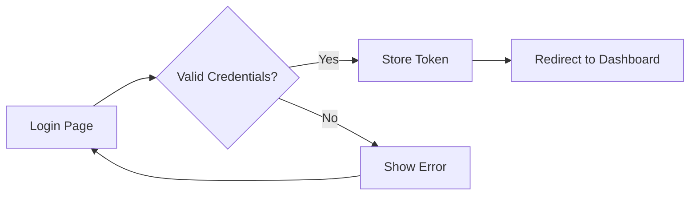
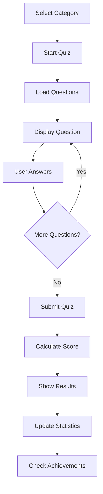

# Ghana Military Quiz - React Frontend Architecture Plan

## Overview
This document outlines the architecture, component structure, and implementation strategy for the React frontend of the Ghana Military Quiz application.

## Technology Stack

### Core Technologies
- **React**: 18.2+ (UI library)
- **TypeScript**: 5.0+ (Type safety)
- **Vite**: 5.0+ (Build tool and dev server)
- **React Router**: 6.20+ (Client-side routing)

### State Management
- **React Context API**: Global state (auth, theme)
- **React Query (TanStack Query)**: Server state management and caching
- **Zustand**: Lightweight state management for UI state

### UI & Styling
- **Tailwind CSS**: 3.4+ (Utility-first CSS framework)
- **Headless UI**: Accessible UI components
- **Heroicons**: Icon library
- **Framer Motion**: Animations and transitions

### Form Handling & Validation
- **React Hook Form**: 7.49+ (Form state management)
- **Zod**: Schema validation

### HTTP & API
- **Axios**: HTTP client with interceptors
- **Axios Retry**: Automatic retry logic

### Charts & Visualization
- **Recharts**: 2.10+ (Charts for statistics)

### Development Tools
- **ESLint**: Code linting
- **Prettier**: Code formatting
- **Husky**: Git hooks
- **TypeScript**: Static type checking

## Project Structure

```
frontend/
├── public/
│   ├── favicon.ico
│   └── assets/
│       └── images/
├── src/
│   ├── api/                    # API client and endpoints
│   │   ├── client.ts          # Axios instance with interceptors
│   │   ├── endpoints/
│   │   │   ├── auth.ts
│   │   │   ├── quiz.ts
│   │   │   ├── categories.ts
│   │   │   ├── achievements.ts
│   │   │   └── users.ts
│   │   └── types.ts           # API response types
│   ├── components/            # Reusable components
│   │   ├── common/           # Generic reusable components
│   │   │   ├── Button.tsx
│   │   │   ├── Card.tsx
│   │   │   ├── Input.tsx
│   │   │   ├── Modal.tsx
│   │   │   ├── Spinner.tsx
│   │   │   ├── Alert.tsx
│   │   │   └── Badge.tsx
│   │   ├── layout/           # Layout components
│   │   │   ├── Header.tsx
│   │   │   ├── Footer.tsx
│   │   │   ├── Sidebar.tsx
│   │   │   ├── Navigation.tsx
│   │   │   └── Layout.tsx
│   │   ├── auth/             # Authentication components
│   │   │   ├── LoginForm.tsx
│   │   │   ├── RegisterForm.tsx
│   │   │   ├── ProtectedRoute.tsx
│   │   │   └── AuthGuard.tsx
│   │   ├── quiz/             # Quiz-related components
│   │   │   ├── QuizCard.tsx
│   │   │   ├── QuestionCard.tsx
│   │   │   ├── AnswerOption.tsx
│   │   │   ├── QuizTimer.tsx
│   │   │   ├── QuizProgress.tsx
│   │   │   ├── QuizResults.tsx
│   │   │   └── QuizSummary.tsx
│   │   ├── category/         # Category components
│   │   │   ├── CategoryCard.tsx
│   │   │   ├── CategoryList.tsx
│   │   │   └── CategoryFilter.tsx
│   │   ├── achievement/      # Achievement components
│   │   │   ├── AchievementCard.tsx
│   │   │   ├── AchievementBadge.tsx
│   │   │   └── AchievementList.tsx
│   │   ├── profile/          # User profile components
│   │   │   ├── ProfileCard.tsx
│   │   │   ├── ProfileStats.tsx
│   │   │   ├── ProfileEdit.tsx
│   │   │   └── ProgressChart.tsx
│   │   └── leaderboard/      # Leaderboard components
│   │       ├── LeaderboardTable.tsx
│   │       ├── LeaderboardRow.tsx
│   │       └── LeaderboardFilters.tsx
│   ├── pages/                # Page components
│   │   ├── Home.tsx
│   │   ├── Login.tsx
│   │   ├── Register.tsx
│   │   ├── Dashboard.tsx
│   │   ├── Categories.tsx
│   │   ├── Quiz.tsx
│   │   ├── QuizResults.tsx
│   │   ├── Profile.tsx
│   │   ├── Achievements.tsx
│   │   ├── Leaderboard.tsx
│   │   ├── Statistics.tsx
│   │   ├── Admin/
│   │   │   ├── AdminDashboard.tsx
│   │   │   ├── ManageQuestions.tsx
│   │   │   ├── ManageCategories.tsx
│   │   │   └── ManageUsers.tsx
│   │   └── NotFound.tsx
│   ├── hooks/                # Custom React hooks
│   │   ├── useAuth.ts
│   │   ├── useQuiz.ts
│   │   ├── useCategories.ts
│   │   ├── useAchievements.ts
│   │   ├── useLeaderboard.ts
│   │   ├── useTimer.ts
│   │   ├── useLocalStorage.ts
│   │   └── useDebounce.ts
│   ├── context/              # React Context providers
│   │   ├── AuthContext.tsx
│   │   ├── ThemeContext.tsx
│   │   └── QuizContext.tsx
│   ├── store/                # Zustand stores
│   │   ├── uiStore.ts
│   │   └── quizStore.ts
│   ├── utils/                # Utility functions
│   │   ├── formatters.ts     # Date, number formatting
│   │   ├── validators.ts     # Custom validators
│   │   ├── constants.ts      # App constants
│   │   ├── helpers.ts        # Helper functions
│   │   └── storage.ts        # LocalStorage utilities
│   ├── types/                # TypeScript type definitions
│   │   ├── user.ts
│   │   ├── quiz.ts
│   │   ├── category.ts
│   │   ├── achievement.ts
│   │   └── index.ts
│   ├── styles/               # Global styles
│   │   ├── index.css
│   │   └── tailwind.css
│   ├── config/               # Configuration files
│   │   ├── api.config.ts
│   │   └── app.config.ts
│   ├── App.tsx               # Root component
│   ├── main.tsx              # Entry point
│   └── vite-env.d.ts         # Vite type definitions
├── .env.example              # Environment variables template
├── .env.development          # Development environment
├── .env.production           # Production environment
├── .eslintrc.json            # ESLint configuration
├── .prettierrc               # Prettier configuration
├── tailwind.config.js        # Tailwind CSS configuration
├── tsconfig.json             # TypeScript configuration
├── vite.config.ts            # Vite configuration
├── package.json              # Dependencies and scripts
└── README.md                 # Frontend documentation
```

## Component Architecture

### Component Hierarchy

```
App
├── AuthProvider
│   ├── ThemeProvider
│   │   ├── QueryClientProvider
│   │   │   ├── Router
│   │   │   │   ├── Layout
│   │   │   │   │   ├── Header
│   │   │   │   │   ├── Sidebar (conditional)
│   │   │   │   │   ├── Main Content (Routes)
│   │   │   │   │   └── Footer
```

### Page Components

#### Public Pages
- **Home**: Landing page with app overview
- **Login**: User authentication
- **Register**: New user registration

#### Protected Pages (Authenticated Users)
- **Dashboard**: User overview with quick stats
- **Categories**: Browse quiz categories
- **Quiz**: Active quiz interface
- **QuizResults**: Results after completing quiz
- **Profile**: User profile and settings
- **Achievements**: User achievements and badges
- **Leaderboard**: Global and category leaderboards
- **Statistics**: Detailed user statistics and charts

#### Admin Pages (Admin Role Only)
- **AdminDashboard**: Admin overview
- **ManageQuestions**: CRUD operations for questions
- **ManageCategories**: CRUD operations for categories
- **ManageUsers**: User management

## State Management Strategy

### 1. Authentication State (React Context)
```typescript
interface AuthState {
  user: User | null;
  token: string | null;
  isAuthenticated: boolean;
  isLoading: boolean;
  login: (credentials: LoginCredentials) => Promise<void>;
  register: (data: RegisterData) => Promise<void>;
  logout: () => void;
  updateProfile: (data: Partial<User>) => Promise<void>;
}
```

### 2. Server State (React Query)
- **Queries**: Fetching data (categories, questions, achievements, leaderboard)
- **Mutations**: Creating, updating, deleting data
- **Caching**: Automatic caching and invalidation
- **Optimistic Updates**: Immediate UI updates

### 3. UI State (Zustand)
```typescript
interface UIState {
  sidebarOpen: boolean;
  theme: 'light' | 'dark';
  notifications: Notification[];
  toggleSidebar: () => void;
  setTheme: (theme: 'light' | 'dark') => void;
  addNotification: (notification: Notification) => void;
  removeNotification: (id: string) => void;
}
```

### 4. Quiz State (Zustand + Context)
```typescript
interface QuizState {
  currentQuiz: Quiz | null;
  currentQuestionIndex: number;
  answers: Answer[];
  timeRemaining: number;
  isSubmitting: boolean;
  startQuiz: (categoryId: number) => void;
  answerQuestion: (answer: Answer) => void;
  nextQuestion: () => void;
  previousQuestion: () => void;
  submitQuiz: () => Promise<void>;
  resetQuiz: () => void;
}
```

## Routing Structure

```typescript
// Public Routes
/                           → Home
/login                      → Login
/register                   → Register

// Protected Routes (Authenticated)
/dashboard                  → Dashboard
/categories                 → Categories
/categories/:id             → Category Details
/quiz/:categoryId           → Quiz Interface
/quiz/:attemptId/results    → Quiz Results
/profile                    → User Profile
/profile/edit               → Edit Profile
/achievements               → Achievements
/leaderboard                → Leaderboard
/statistics                 → Statistics

// Admin Routes (Admin Only)
/admin                      → Admin Dashboard
/admin/questions            → Manage Questions
/admin/questions/new        → Create Question
/admin/questions/:id/edit   → Edit Question
/admin/categories           → Manage Categories
/admin/categories/new       → Create Category
/admin/categories/:id/edit  → Edit Category
/admin/users                → Manage Users

// Error Routes
/404                        → Not Found
/403                        → Forbidden
/500                        → Server Error
```

## API Integration

### Axios Configuration

```typescript
// api/client.ts
import axios from 'axios';

const apiClient = axios.create({
  baseURL: import.meta.env.VITE_API_BASE_URL || 'http://localhost:8080/api',
  timeout: 10000,
  headers: {
    'Content-Type': 'application/json',
  },
});

// Request interceptor - Add auth token
apiClient.interceptors.request.use(
  (config) => {
    const token = localStorage.getItem('token');
    if (token) {
      config.headers.Authorization = `Bearer ${token}`;
    }
    return config;
  },
  (error) => Promise.reject(error)
);

// Response interceptor - Handle errors
apiClient.interceptors.response.use(
  (response) => response.data,
  (error) => {
    if (error.response?.status === 401) {
      // Handle unauthorized - redirect to login
      localStorage.removeItem('token');
      window.location.href = '/login';
    }
    return Promise.reject(error);
  }
);
```

### React Query Setup

```typescript
// main.tsx
import { QueryClient, QueryClientProvider } from '@tanstack/react-query';

const queryClient = new QueryClient({
  defaultOptions: {
    queries: {
      staleTime: 5 * 60 * 1000, // 5 minutes
      cacheTime: 10 * 60 * 1000, // 10 minutes
      retry: 1,
      refetchOnWindowFocus: false,
    },
  },
});
```

## UI/UX Design Principles

### Color Scheme (Ghana Military Theme)
```css
/* Primary Colors */
--color-primary: #1E3A8A;      /* Deep Blue */
--color-secondary: #059669;     /* Green */
--color-accent: #DC2626;        /* Red */
--color-gold: #F59E0B;          /* Gold for achievements */

/* Neutral Colors */
--color-gray-50: #F9FAFB;
--color-gray-100: #F3F4F6;
--color-gray-900: #111827;

/* Status Colors */
--color-success: #10B981;
--color-warning: #F59E0B;
--color-error: #EF4444;
--color-info: #3B82F6;
```

### Typography
- **Headings**: Inter (Bold, 600-700 weight)
- **Body**: Inter (Regular, 400 weight)
- **Monospace**: JetBrains Mono (for code/stats)

### Responsive Breakpoints
```javascript
// tailwind.config.js
module.exports = {
  theme: {
    screens: {
      'sm': '640px',
      'md': '768px',
      'lg': '1024px',
      'xl': '1280px',
      '2xl': '1536px',
    },
  },
};
```

### Design Patterns
1. **Mobile-First**: Design for mobile, enhance for desktop
2. **Accessibility**: WCAG 2.1 AA compliance
3. **Progressive Enhancement**: Core functionality works without JavaScript
4. **Loading States**: Skeleton screens and spinners
5. **Error Handling**: User-friendly error messages
6. **Feedback**: Toast notifications for actions

## Key Features Implementation

### 1. Authentication Flow


### 2. Quiz Flow


### 3. Real-time Features
- **Quiz Timer**: Countdown timer with auto-submit
- **Progress Tracking**: Real-time progress updates
- **Leaderboard Updates**: Periodic refresh

## Performance Optimization

### Code Splitting
```typescript
// Lazy load pages
const Dashboard = lazy(() => import('./pages/Dashboard'));
const Quiz = lazy(() => import('./pages/Quiz'));
const Profile = lazy(() => import('./pages/Profile'));
```

### Image Optimization
- Use WebP format with fallbacks
- Lazy load images below the fold
- Implement responsive images

### Caching Strategy
- **React Query**: Automatic caching for API responses
- **Service Worker**: Cache static assets (future enhancement)
- **LocalStorage**: Cache user preferences

### Bundle Optimization
- Tree shaking with Vite
- Code splitting by route
- Minimize third-party dependencies

## Security Considerations

### 1. Authentication
- Store JWT in httpOnly cookies (if backend supports) or localStorage
- Implement token refresh mechanism
- Auto-logout on token expiration

### 2. Input Validation
- Client-side validation with Zod
- Sanitize user inputs
- Prevent XSS attacks

### 3. API Security
- CORS configuration
- CSRF protection
- Rate limiting (backend)

### 4. Sensitive Data
- Never log sensitive information
- Mask passwords in forms
- Secure environment variables

## Testing Strategy

### Unit Tests (Vitest)
- Component rendering
- Utility functions
- Custom hooks

### Integration Tests (React Testing Library)
- User interactions
- Form submissions
- API integration

### E2E Tests (Playwright - Optional)
- Critical user flows
- Authentication flow
- Quiz completion flow

## Deployment Strategy

### Build Process
```bash
# Development
npm run dev

# Production build
npm run build

# Preview production build
npm run preview
```

### Environment Variables
```env
# .env.production
VITE_API_BASE_URL=https://api.ghanamilitaryquiz.com/api
VITE_APP_NAME=Ghana Military Quiz
VITE_APP_VERSION=1.0.0
```

### Hosting Options
1. **Vercel**: Recommended for React apps
2. **Netlify**: Alternative with good CI/CD
3. **AWS S3 + CloudFront**: For enterprise deployment
4. **GitHub Pages**: For demo/testing

## Implementation Roadmap

### Phase 1: Foundation (Week 1)
- [ ] Project setup with Vite + TypeScript
- [ ] Install and configure dependencies
- [ ] Setup Tailwind CSS
- [ ] Create project structure
- [ ] Configure ESLint and Prettier
- [ ] Setup API client with Axios
- [ ] Implement authentication context
- [ ] Create basic layout components

### Phase 2: Authentication (Week 1-2)
- [ ] Login page and form
- [ ] Register page and form
- [ ] Protected route component
- [ ] Auth state management
- [ ] Token storage and refresh
- [ ] Logout functionality

### Phase 3: Core Features (Week 2-3)
- [ ] Dashboard page
- [ ] Categories page and components
- [ ] Quiz interface
- [ ] Question display and navigation
- [ ] Answer submission
- [ ] Quiz timer
- [ ] Results page

### Phase 4: User Features (Week 3-4)
- [ ] User profile page
- [ ] Profile editing
- [ ] Statistics page with charts
- [ ] Achievements page
- [ ] Leaderboard page
- [ ] Progress tracking

### Phase 5: Admin Features (Week 4-5)
- [ ] Admin dashboard
- [ ] Question management (CRUD)
- [ ] Category management (CRUD)
- [ ] User management
- [ ] Admin analytics

### Phase 6: Polish & Optimization (Week 5-6)
- [ ] Responsive design refinement
- [ ] Loading states and skeletons
- [ ] Error handling and validation
- [ ] Animations and transitions
- [ ] Performance optimization
- [ ] Accessibility improvements
- [ ] Testing
- [ ] Documentation

## Next Steps

1. **Review and Approve Architecture**: Ensure all stakeholders agree with the proposed architecture
2. **Setup Development Environment**: Install Node.js, npm, and required tools
3. **Initialize Project**: Create Vite project with TypeScript template
4. **Install Dependencies**: Add all required packages
5. **Begin Phase 1 Implementation**: Start with project foundation

## Resources

- [React Documentation](https://react.dev/)
- [Vite Documentation](https://vitejs.dev/)
- [Tailwind CSS Documentation](https://tailwindcss.com/)
- [React Query Documentation](https://tanstack.com/query/latest)
- [React Router Documentation](https://reactrouter.com/)
- [TypeScript Documentation](https://www.typescriptlang.org/)
